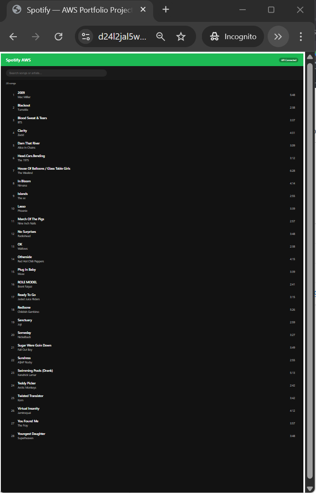
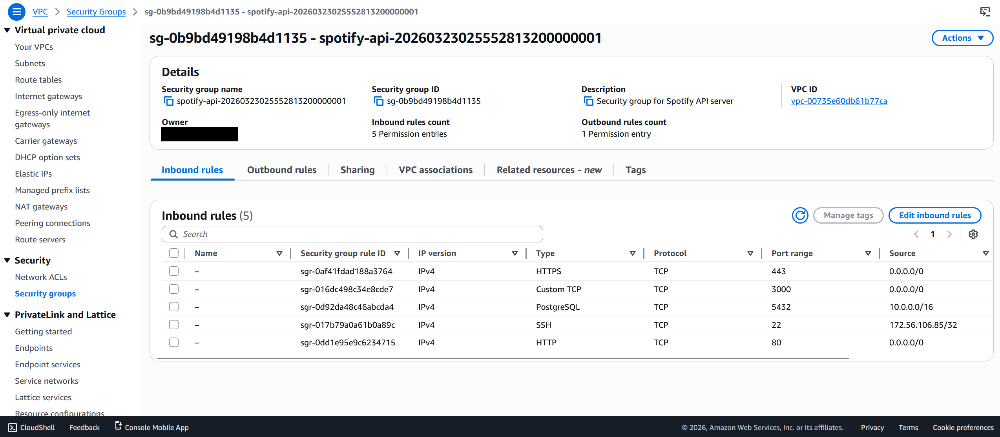
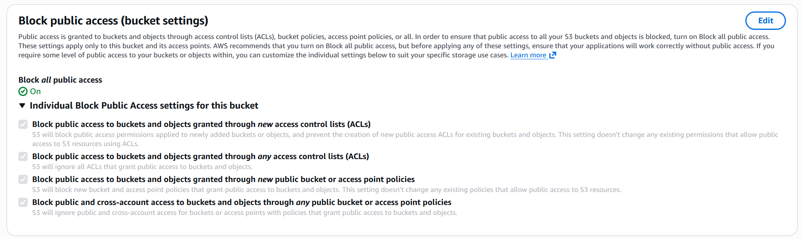
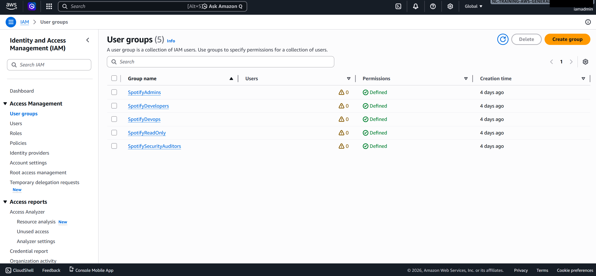
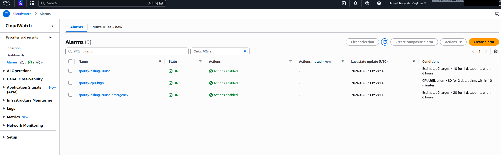

# AWS Spotify -- Microscaled Cloud Architecture


> **Archive Notice:** This project's AWS infrastructure has been decommissioned. All resources were provisioned, operated, documented, and then torn down. Terraform modules, IAM policies, screenshots, and documentation remain as portfolio artifacts.

A microscaled implementation of Spotify's backend architecture on AWS, designed to demonstrate IAM policy design, Terraform IaC, VPC networking, and cloud security controls -- all within a $10/month budget.

---

## Architecture

<p align="center">
  
</p>

### Data Flow: Playing a Song

<p align="center">
  
</p>

1. User hits Play in the React SPA (served via CloudFront from S3)
2. CloudFront forwards `/api/*` requests to the EC2 origin
3. EC2 validates the Cognito JWT, queries PostgreSQL for metadata
4. API generates a 15-minute presigned S3 URL for the audio file
5. Client streams audio directly from S3 via the presigned URL

---

## Infrastructure

| AWS Service | Resource | Managed By |
|-------------|----------|------------|
| VPC | 10.0.0.0/16, public subnet, IGW, security group | Terraform |
| EC2 | t3.micro, Amazon Linux 2023, 20GB encrypted gp3 | Terraform |
| S3 | Audio bucket (SSE-S3, versioned, lifecycle, CORS) | Terraform |
| S3 | Frontend bucket (static hosting via CloudFront OAC) | Terraform |
| CloudFront | Dual-origin CDN (S3 frontend + EC2 API) | Terraform |
| Cognito | User pool, 2 app clients, MFA optional | Terraform |
| CloudWatch | Billing alarms ($10/$20), CPU alarm, SNS alerts | Terraform |
| IAM | 5 groups, 3 custom policies, EC2 role, permission boundary | AWS CLI |
| CloudTrail | Multi-region audit trail, log file validation | AWS CLI |
| GuardDuty | Threat detection, 15-min publishing | AWS CLI |
| AWS Config | 4 compliance rules (S3 encryption, EC2 VPC, root MFA/keys) | AWS CLI |

**Total Terraform-managed resources:** 35

---

## Security Controls

<p align="center">
  
</p>

### Preventive
- IAM least-privilege policies with resource-level ARN scoping
- Permission boundaries as privilege ceilings
- S3 Block Public Access on all buckets
- Security groups: SSH restricted to single admin IP
- Encryption at rest (SSE-S3, encrypted EBS) and in transit (TLS 1.2+)

### Detective
- CloudTrail API logging (multi-region, log file validation)
- GuardDuty threat detection
- AWS Config compliance rules (S3 encryption, EC2 in VPC, root MFA, root access keys)
- IAM Access Analyzer
- CloudWatch billing and CPU alarms with SNS notifications

---

## Project Structure

```
aws-spotify/
  terraform/
    modules/             # vpc, ec2, s3, cloudfront, cognito, monitoring
    environments/        # dev (provider config, module calls)
  iam-policies/          # 6 IAM policy JSON documents
  cloudformation/        # Supplementary CF templates (Terraform comparison)
  frontend/              # React SPA (Vite, deployed to S3)
  docs/
    runbook/             # Operational runbook
    grc/                 # Governance, Risk, Compliance (NIST 800-53, CIS)
    postmortem/          # INC-001: S3 public access incident report
    diagrams/            # AWS console screenshots
    project-proof-of-work.md
```

---

## Documentation

| Document | Description |
|----------|-------------|
| [Runbook](docs/runbook/AWS_Spotify_Runbook_v2.md) | Architecture decisions, IAM deep dive, Terraform modules, security services |
| [GRC](docs/grc/governance-risk-compliance.md) | NIST 800-53 controls, CIS AWS Foundations Benchmark, risk matrix |
| [Postmortem](docs/postmortem/INC-001-s3-public-exposure.md) | S3 incident: timeline, root cause analysis, remediation |
| [Proof of Work](docs/project-proof-of-work.md) | Phase-by-phase build log with debugging journal |
| [Directory Map](directory.md) | Full repo navigation with file-level descriptions |
| [CloudFormation](cloudformation/README.md) | Terraform vs CloudFormation comparison |

---

## Screenshots

<p align="center">
  
</p>

<details>
<summary><b>AWS Console Screenshots</b> (click to expand)</summary>
<br>

**Security Group Inbound Rules**


**S3 Block Public Access**


**IAM Groups**


**CloudWatch Alarms**


All screenshots are in [`docs/diagrams/`](docs/diagrams/).

</details>

---

## Cost Breakdown

| Service | Monthly Cost |
|---------|-------------|
| EC2 t3.micro (on-demand) | $7.59 |
| S3 Standard (300 MB) | $0.01 |
| CloudFront (1 TB free tier) | $0.00 |
| Cognito (50 MAU free tier) | $0.00 |
| CloudWatch (free tier) | $0.00 |
| **Total** | **~$8/month** |

---

## License

MIT
