# AWS Spotify Project -- Complete Runbook
**Microscaled Spotify Architecture on AWS with Terraform, IAM, and Security Deep Dive**
**Author:** Nathan Lim | **Updated:** March 2026


# Project Overview

> **Companion Documents:** This runbook is paired with `project-proof-of-work.pdf` (build log with terminal evidence, debugging journal, and screenshot guide) and `directory.md` (repo navigation map). The proof-of-work document contains the 50-item screenshot guide mapping AWS console visuals to the exact Terraform code that created each resource. and Architecture Baseline

## What This Project Is

This is a microscaled implementation of Spotify's backend architecture deployed on AWS, designed to demonstrate enterprise-grade IAM, security controls, infrastructure-as-code (Terraform), and cloud cost management — all within a $10/month operational budget.

The project is NOT a full Spotify clone. It is a focused cloud infrastructure and security showcase that uses the Spotify system design as a realistic, relatable context to demonstrate:

- AWS IAM policy design, role delegation, and least-privilege enforcement
- VPC networking, security groups, and network segmentation
- Terraform IaC from zero to deployed infrastructure
- Cost optimization decision-making under real constraints
- Monitoring, observability, and incident response patterns
- GRC (Governance, Risk, Compliance) simulation
- AWS Well-Architected Framework alignment

## Architecture Decisions — The "Why" Behind Every Choice

Every architectural decision in this project has a root cause. This section documents the reasoning behind each choice.

### Compute: EC2 t3.micro ($7.59/mo on-demand in us-east-1)

**What Spotify actually uses:** Spotify runs on Google Cloud Platform (GCP) with Google Kubernetes Engine (GKE) for containerized microservices. Before their GCP migration (completed 2018), they ran on-premises data centers.

**What we use and why:** A single EC2 t3.micro instance running the API server and PostgreSQL database.

**Root cause for this decision:**

- EC2 is the closest AWS analog to Spotify's compute layer — it represents a general-purpose server hosting application code
- t3.micro provides 2 vCPUs and 1 GiB RAM with burstable CPU credits — sufficient for 50 simulated users
- At $0.0104/hour ($7.59/month on-demand), it is the cheapest EC2 instance type that can run both a Node.js API server and PostgreSQL simultaneously
- Lambda was rejected because it architecturally diverges from Spotify's always-on server model and doesn't demonstrate VPC networking, security groups, or SSH hardening — all critical for an IAM/security portfolio
- ECS Fargate was rejected because the ALB/NLB requirement alone costs $16+/month, exceeding the $10 budget before compute even starts

### Database: PostgreSQL Self-Hosted on EC2 ($0 incremental)

**What Spotify actually uses:** Spotify uses PostgreSQL heavily for metadata storage, along with Cassandra for high-throughput data and BigTable on GCP for analytics.

**What we use and why:** PostgreSQL 16 installed directly on the EC2 instance.

**Root cause for this decision:**

- RDS PostgreSQL db.t3.micro costs $12.41/month post-free-tier — this alone exceeds the $10 budget
- Self-hosting PostgreSQL on the same EC2 instance costs $0 incremental — we're already paying for the compute
- The database schema (users, songs, artists, playlists, playlistitems, artistsongs) uses PostgreSQL-native types: `bigint`, `citext`, `timestamptz` — matching Spotify's actual production stack
- Self-hosting forces you to understand backup strategies, connection pooling, and OS-level database security — all topics enterprise environments deal with

### Storage: S3 for Audio Files

**What Spotify actually uses:** Google Cloud Storage (GCS) for audio file storage, with extensive CDN caching via Google's edge network.

**What we use and why:** AWS S3 Standard tier with CloudFront CDN.

**Root cause:** S3 is the direct AWS equivalent of GCS. At our scale (300MB of audio = $0.007/month), storage cost is negligible. The real value is demonstrating S3 bucket policies, presigned URLs (time-limited access), server-side encryption (SSE-S3), CORS configuration, and lifecycle policies.

### Authentication: Cognito + Custom JWT (Hybrid)

**What Spotify actually uses:** Custom OAuth 2.0 implementation with PKCE flow for third-party integrations, internal service mesh authentication for microservice-to-microservice calls.

**What we use and why:** AWS Cognito for user-facing authentication (sign-up, sign-in, MFA, token management) combined with custom JWT tokens for service-to-service API authorization.

**Root cause for the hybrid approach:**

- Cognito demonstrates enterprise identity management — the same service used in AWS SSO/Identity Center environments
- Cognito User Pools handle password policies, MFA enforcement, and token rotation — you don't build these from scratch in production
- Custom JWT for API authorization demonstrates that you understand how services validate identity independently of the IdP
- The hybrid pattern mirrors real enterprise architectures: Okta/Azure AD for human identity, service accounts with JWT for machine identity

### Frontend: Static React/HTML on S3 + CloudFront

**Root cause:** The frontend is not the point of this project. A minimal React SPA hosted on S3 behind CloudFront demonstrates static asset hosting, CDN configuration, and HTTPS enforcement without introducing a separate compute cost. It provides just enough UI to visually demo song streaming, playlist management, and user authentication flows.

### IaC: Terraform Primary, CloudFormation Supplementary

**Root cause:** Terraform is cloud-agnostic and is the industry standard for multi-cloud IaC. CloudFormation is AWS-native and still heavily used in AWS-only shops. Demonstrating both shows versatility. Terraform handles all resource provisioning; 2-3 CloudFormation templates are included as comparative examples to show you can read, write, and reason about both.

## Target Architecture Baseline

The following values are the exact design targets from the Brain Dump documentation. This is the baseline — everything in this runbook builds toward and from these numbers.

### Scale Targets

| Parameter | Value | Rationale |
|-----------|-------|-----------|
| Songs | 100 | Enough to demonstrate search, playlist CRUD, and streaming patterns |
| Users | 50 | Sufficient to simulate concurrent access and playlist sharing |
| Audio quality tiers | 64 / 128 / 320 kbps | Matches Spotify's actual bitrate tiers (mobile/standard/premium) |
| Average song size | 3 MB (at 128kbps standard) | Industry standard for a 3.5-minute track |
| Total audio storage | 300 MB raw (600-900 MB with multi-bitrate) | Well within S3 free tier thresholds |
| User metadata | 1 KB × 50 = 50 KB | Profiles, preferences, playlist references |
| Song metadata | 100 bytes × 100 = 10 KB | Title, artist refs, duration, file URLs |
| Daily bandwidth per user | 30-45 MB (10-15 streams × 3 MB) | Moderate usage pattern |
| Total daily egress | 1.5 - 2.25 GB (50 users × 30-45 MB) | ~45-67.5 GB/month |

### Monthly Cost Budget

| Service | Estimated Cost | Notes |
|---------|---------------|-------|
| EC2 t3.micro (on-demand) | $7.59 | 24/7 uptime, us-east-1 |
| S3 Standard (300 MB) | $0.01 | $0.023/GB for first 50TB |
| CloudFront (67.5 GB egress) | $0.00 | First 1TB/month free (always free) |
| Cognito (50 MAU) | $0.00 | First 50K MAU free |
| CloudWatch (basic) | $0.00 | Basic monitoring free |
| Route 53 (optional) | $0.50 | 1 hosted zone |
| **Total** | **~$8.10** | Under $10 target |

### Emergency Budget Controls

- **Billing alarm at $10** — immediate notification via SNS
- **Billing alarm at $15** — warning escalation
- **Billing alarm at $20** — hard stop, manual review required
- **AWS Budgets** configured with auto-notification at 80%, 100%, and 150% thresholds

## High-Level Architecture Overview

This is the adapted version of the Lucidchart diagram from the Brain Dump, scaled down from the 3-server production vision to the microscale single-instance deployment:



### Data Flow: User Plays a Song


This maps directly to the User System Workflow diagram from the Brain Dump:

1. **User hits Play** in the React client
2. Client sends `GET /songs/{id}` with the Cognito-issued JWT in the Authorization header
3. Request hits CloudFront, which forwards API requests to the EC2 origin
4. EC2 API server validates the JWT against Cognito's JWKS endpoint
5. If JWT is valid: API queries PostgreSQL for song metadata (title, artist, duration, file URL)
6. API generates a presigned S3 URL (expires in 15 minutes) for the audio file
7. API returns metadata + presigned URL to the client
8. Client uses the presigned URL to stream audio directly from S3/CloudFront via HTTP Range Requests
9. Client sends `POST /songs/{id}/play` to log the play event for analytics
10. If JWT is invalid: API returns 401 Authentication Error

### Data Flow: Artist Uploads a Song

This maps to the Artist System Workflow diagram:

1. Artist submits `POST /songs/upload` (multipart: audio file + metadata) with JWT
2. API validates JWT and checks artist role
3. API validates file format (Ogg/AAC only) and size (max 20MB)
4. If invalid: return 400 with specific error (unsupported format or size exceeded)
5. If valid: upload file to S3 under `/pending/{upload_id}/`
6. Extract audio metadata (duration, bitrate) using ffprobe
7. Insert song, artist, and artistsongs mapping records in PostgreSQL
8. Move file from `/pending/` to `/artist/{artist_id}/album/{album_id}/`
9. Invalidate CloudFront cache for the artist/album path
10. Return 201 Created with song metadata


## Prerequisites

| Tool | Version Used | Purpose |
|------|-------------|---------|
| WSL2 (Ubuntu 24.04) | Kernel 5.15 | Primary CLI environment |
| Terraform | v1.14.7 | Infrastructure as Code |
| AWS CLI | v2.x | AWS resource management |
| Node.js | v22.x LTS | API server runtime |
| PostgreSQL | 16.x | Database |
| Git | 2.43.x | Version control |

All commands in this runbook are executed from WSL2. The project root is `/mnt/c/dev/aws-spotify/`.

# AWS Account Hardening and IAM Foundation

This is the most critical section of the entire runbook. IAM misconfigurations are the #1 cause of AWS security breaches. Every permission, role, and policy in this section has a root cause explanation.

## Root Account Lockdown

**Root cause:** The AWS root account has unrestricted access to every service and resource. It cannot be constrained by IAM policies. If compromised, an attacker has total control: they can delete all resources, create new accounts, change billing, and lock you out permanently. The root account should be used exactly twice — to create the AWS account and to enable MFA on it — then never again.

### Step 1: Enable MFA on Root Account

1. Sign in to `https://console.aws.amazon.com` with your root email
2. Click your account name (top right) → **Security credentials**
3. Under "Multi-factor authentication (MFA)" → **Assign MFA device**
4. Choose **Authenticator app** (Google Authenticator, Authy, or 1Password)
5. Scan the QR code with your authenticator app
6. Enter two consecutive MFA codes to verify
7. Click **Assign MFA**

**Why authenticator app and not SMS:** SMS-based MFA is vulnerable to SIM-swapping attacks. An attacker can convince your phone carrier to port your number to their SIM card, intercepting all SMS codes. TOTP authenticator apps generate codes locally — no interception vector.

### Step 2: Delete Root Access Keys

1. In Security credentials, check "Access keys"
2. If any access keys exist, **delete them immediately**
3. Root access keys in a config file or script is the most dangerous credential exposure possible

### Step 3: Create an IAM Admin User

**Root cause:** Instead of using root, you create an IAM user with AdministratorAccess. This user is still powerful, but crucially it CAN be constrained by SCPs, permission boundaries, and IAM policies. It's also logged by CloudTrail, unlike some root actions.

```powershell
# You'll do this from the console for the first user, then switch to CLI
```

1. Go to IAM → Users → Create user
2. User name: `nathan-admin`
3. Check "Provide user access to the AWS Management Console"
4. Select "I want to create an IAM user"
5. Set a strong password
6. Uncheck "Users must create a new password at next sign-in" (it's just you)
7. Click Next
8. Select "Attach policies directly"
9. Search and select `AdministratorAccess`
10. Click Create user
11. Download the CSV with credentials

Now enable MFA on this user too:
1. IAM → Users → nathan-admin → Security credentials
2. Assign MFA device (same process as root)

### Step 4: Create Access Keys for CLI

1. IAM → Users → nathan-admin → Security credentials
2. Create access key → Select "Command Line Interface (CLI)"
3. Acknowledge the warning
4. Download the CSV (this is the ONLY time you'll see the secret key)

Now configure the CLI:

```powershell
aws configure --profile spotify-admin
# Access Key ID: [paste from CSV]
# Secret Access Key: [paste from CSV]
# Region: us-east-1
# Output: json
```

Set as default profile:

```powershell
$env:AWS_PROFILE = "spotify-admin"
# Or add to your PowerShell profile for persistence:
# Add-Content $PROFILE 'Set-Item -Path Env:AWS_PROFILE -Value "spotify-admin"'
```

Verify:

```powershell
aws sts get-caller-identity
# Should return your account ID, ARN, and user ID
```

## IAM Groups and Simulated Roles

**Root cause:** In enterprise environments, you never attach policies directly to users. You create groups that represent job functions, attach policies to groups, then add users to groups. This scales — when a new developer joins, you add them to the "Developers" group instead of manually attaching 15 policies.

Even though this is a solo project, we create the group structure to demonstrate enterprise-grade IAM design.

### Group Structure

```powershell
# Create IAM groups
aws iam create-group --group-name SpotifyAdmins
aws iam create-group --group-name SpotifyDevelopers
aws iam create-group --group-name SpotifyDevOps
aws iam create-group --group-name SpotifySecurityAuditors
aws iam create-group --group-name SpotifyReadOnly
```

### Custom IAM Policies — Line-by-Line Breakdown

#### Developer Policy

This policy grants what a developer building the Spotify app would need — no more.

```json
{
  "Version": "2012-10-17",
  "Statement": [
    {
      "Sid": "EC2DeveloperAccess",
      "Effect": "Allow",
      "Action": [
        "ec2:DescribeInstances",
        "ec2:DescribeSecurityGroups",
        "ec2:DescribeSubnets",
        "ec2:DescribeVpcs"
      ],
      "Resource": "*",
      "Condition": {
        "StringEquals": {
          "aws:RequestedRegion": "us-east-1"
        }
      }
    },
    {
      "Sid": "S3AppBucketAccess",
      "Effect": "Allow",
      "Action": [
        "s3:GetObject",
        "s3:PutObject",
        "s3:ListBucket",
        "s3:DeleteObject"
      ],
      "Resource": [
        "arn:aws:s3:::spotify-audio-*",
        "arn:aws:s3:::spotify-audio-*/*"
      ]
    },
    {
      "Sid": "CloudWatchReadLogs",
      "Effect": "Allow",
      "Action": [
        "logs:GetLogEvents",
        "logs:DescribeLogGroups",
        "logs:DescribeLogStreams",
        "logs:FilterLogEvents"
      ],
      "Resource": "arn:aws:logs:us-east-1:*:log-group:/spotify/*"
    },
    {
      "Sid": "CognitoReadOnly",
      "Effect": "Allow",
      "Action": [
        "cognito-idp:DescribeUserPool",
        "cognito-idp:ListUsers",
        "cognito-idp:AdminGetUser"
      ],
      "Resource": "arn:aws:cognito-idp:us-east-1:*:userpool/*"
    }
  ]
}
```

**Line-by-line root cause analysis:**

- **Version "2012-10-17"**: This is the current IAM policy language version. There is only one other version ("2008-10-17") which lacks features like policy variables. Always use 2012-10-17.

- **Sid "EC2DeveloperAccess"**: Developers can view (Describe*) EC2 resources but not create, modify, or terminate them. The `Condition` block restricts this to us-east-1 only — a developer cannot accidentally spin up resources in eu-west-1. **What breaks without the condition:** A developer could list instances in all 30+ regions, potentially discovering resources from other projects or teams.

- **Sid "S3AppBucketAccess"**: Note the two Resource ARNs — `arn:aws:s3:::spotify-audio-*` (the bucket itself, needed for ListBucket) and `arn:aws:s3:::spotify-audio-*/*` (objects inside the bucket, needed for Get/Put/Delete). **Root cause for separation:** S3 has bucket-level operations and object-level operations. ListBucket is a bucket operation; GetObject is an object operation. If you only specify the object ARN, ListBucket fails with AccessDenied. If you only specify the bucket ARN, GetObject fails.

- **Sid "CloudWatchReadLogs"**: Scoped to log groups under `/spotify/` — the developer cannot read logs from other applications or AWS service logs. Read-only because developers should not be able to delete or modify log data (that's a compliance/audit concern).

- **Sid "CognitoReadOnly"**: Developers can view user pool configuration and look up users for debugging, but cannot modify the pool settings (password policies, MFA requirements) or delete users. Pool modifications are an admin/security function.

#### Security Auditor Policy

```json
{
  "Version": "2012-10-17",
  "Statement": [
    {
      "Sid": "SecurityAuditReadAccess",
      "Effect": "Allow",
      "Action": [
        "iam:Get*",
        "iam:List*",
        "iam:GenerateCredentialReport",
        "iam:GenerateServiceLastAccessedDetails",
        "iam:SimulateCustomPolicy",
        "iam:SimulatePrincipalPolicy"
      ],
      "Resource": "*"
    },
    {
      "Sid": "CloudTrailAccess",
      "Effect": "Allow",
      "Action": [
        "cloudtrail:LookupEvents",
        "cloudtrail:GetTrailStatus",
        "cloudtrail:DescribeTrails",
        "cloudtrail:GetEventSelectors"
      ],
      "Resource": "*"
    },
    {
      "Sid": "ConfigAccess",
      "Effect": "Allow",
      "Action": [
        "config:Describe*",
        "config:Get*",
        "config:List*"
      ],
      "Resource": "*"
    },
    {
      "Sid": "GuardDutyAccess",
      "Effect": "Allow",
      "Action": [
        "guardduty:Get*",
        "guardduty:List*"
      ],
      "Resource": "*"
    },
    {
      "Sid": "AccessAnalyzerAccess",
      "Effect": "Allow",
      "Action": [
        "access-analyzer:Get*",
        "access-analyzer:List*"
      ],
      "Resource": "*"
    },
    {
      "Sid": "DenyMutations",
      "Effect": "Deny",
      "Action": [
        "iam:Create*",
        "iam:Delete*",
        "iam:Update*",
        "iam:Put*",
        "iam:Attach*",
        "iam:Detach*",
        "iam:Add*",
        "iam:Remove*"
      ],
      "Resource": "*"
    }
  ]
}
```

**Root cause for the DenyMutations statement:** The Allow on `iam:Get*` and `iam:List*` could theoretically be combined with other policies that grant broader IAM access. The explicit Deny on all mutation actions is a safety guardrail — explicit denies in IAM ALWAYS override explicit allows, regardless of what other policies are attached. This is the IAM policy evaluation logic:

**IAM Policy Evaluation Order:**

1. **Explicit Deny** — if ANY policy says Deny, the action is denied. Period. No override.
2. **Explicit Allow** — if a policy says Allow and there is no Deny, the action is allowed.
3. **Implicit Deny** — if no policy mentions the action at all, it is denied by default.

This three-tier model is fundamental to IAM. The explicit Deny in the SecurityAuditor policy means even if someone accidentally attaches AdministratorAccess to the auditor group, the auditor still cannot modify IAM resources. Defense in depth.

### Permission Boundaries

**Root cause:** Permission boundaries set the MAXIMUM permissions that an IAM entity can have, regardless of what policies are attached. Think of it as a ceiling. If a permission boundary allows only S3 and EC2 actions, attaching AdministratorAccess to that user still only grants S3 and EC2.

This is critical for delegated administration — you can let a DevOps team create IAM roles for their services without fear that they'll create an admin role.

```json
{
  "Version": "2012-10-17",
  "Statement": [
    {
      "Sid": "AllowedServices",
      "Effect": "Allow",
      "Action": [
        "s3:*",
        "ec2:*",
        "cognito-idp:*",
        "cloudfront:*",
        "cloudwatch:*",
        "logs:*",
        "secretsmanager:GetSecretValue",
        "kms:Decrypt",
        "kms:GenerateDataKey"
      ],
      "Resource": "*",
      "Condition": {
        "StringEquals": {
          "aws:RequestedRegion": "us-east-1"
        }
      }
    },
    {
      "Sid": "DenyDangerousActions",
      "Effect": "Deny",
      "Action": [
        "organizations:*",
        "account:*",
        "iam:CreateUser",
        "iam:DeleteUser",
        "iam:CreateAccountAlias",
        "iam:DeleteAccountAlias"
      ],
      "Resource": "*"
    }
  ]
}
```

Create and attach the boundary:

```powershell
aws iam create-policy \
  --policy-name SpotifyPermissionBoundary \
  --policy-document file://terraform/modules/iam/permission-boundary.json

# When creating IAM roles for the project, always include:
# --permissions-boundary arn:aws:iam::<ACCOUNT_ID>:policy/SpotifyPermissionBoundary
```

### IAM Access Analyzer

**Root cause:** IAM Access Analyzer continuously monitors your resource policies and IAM policies for external access — resources shared with accounts or principals outside your AWS organization. It finds things like S3 buckets accidentally made public or IAM roles that can be assumed by any AWS account.

```powershell
aws accessanalyzer create-analyzer \
  --analyzer-name spotify-access-analyzer \
  --type ACCOUNT \
  --region us-east-1
```

### EC2 Instance Role (Most Important IAM Configuration)



**Root cause:** The EC2 instance running your API server needs to access S3 (presigned URLs), Secrets Manager (database password), and CloudWatch (logging). Instead of hardcoding AWS access keys on the instance (a critical security anti-pattern), you attach an IAM Instance Profile. The instance assumes the role automatically via the EC2 metadata service. Credentials rotate automatically every ~6 hours.

```json
{
  "Version": "2012-10-17",
  "Statement": [
    {
      "Sid": "S3AudioBucketAccess",
      "Effect": "Allow",
      "Action": [
        "s3:GetObject",
        "s3:PutObject",
        "s3:DeleteObject",
        "s3:ListBucket"
      ],
      "Resource": [
        "arn:aws:s3:::spotify-audio-<ACCOUNT_ID>",
        "arn:aws:s3:::spotify-audio-<ACCOUNT_ID>/*"
      ]
    },
    {
      "Sid": "S3PresignedURLGeneration",
      "Effect": "Allow",
      "Action": [
        "s3:GetObject"
      ],
      "Resource": "arn:aws:s3:::spotify-audio-<ACCOUNT_ID>/*"
    },
    {
      "Sid": "SecretsManagerDBCredentials",
      "Effect": "Allow",
      "Action": [
        "secretsmanager:GetSecretValue"
      ],
      "Resource": "arn:aws:secretsmanager:us-east-1:<ACCOUNT_ID>:secret:spotify/db-*"
    },
    {
      "Sid": "CloudWatchLogging",
      "Effect": "Allow",
      "Action": [
        "logs:CreateLogGroup",
        "logs:CreateLogStream",
        "logs:PutLogEvents",
        "logs:DescribeLogStreams"
      ],
      "Resource": "arn:aws:logs:us-east-1:<ACCOUNT_ID>:log-group:/spotify/*"
    },
    {
      "Sid": "CloudWatchMetrics",
      "Effect": "Allow",
      "Action": [
        "cloudwatch:PutMetricData"
      ],
      "Resource": "*",
      "Condition": {
        "StringEquals": {
          "cloudwatch:namespace": "Spotify/API"
        }
      }
    }
  ]
}
```

**Root cause for each statement:**

- **S3AudioBucketAccess**: The API server needs to read audio files (for metadata extraction), write files (artist uploads), delete files (content moderation), and list bucket contents (search functionality). Scoped to the exact bucket ARN — not `s3:*` on `*`.

- **S3PresignedURLGeneration**: Presigned URLs inherit the permissions of the signer. When the EC2 instance generates a presigned URL for `s3:GetObject`, the URL works only because the instance role has `s3:GetObject` permission. If you remove this, presigned URLs return 403.

- **SecretsManagerDBCredentials**: The database password is stored in AWS Secrets Manager, not in environment variables or config files. The instance retrieves it at application startup. The resource ARN uses a wildcard suffix (`-*`) because Secrets Manager appends a random suffix to secret ARNs.

- **CloudWatchLogging**: Application logs go to CloudWatch Logs. `CreateLogGroup` is needed on first deployment only (when the log group doesn't exist yet). In production, you'd pre-create the log group via Terraform and remove `CreateLogGroup` from this policy.

- **CloudWatchMetrics with namespace condition**: Custom metrics (API latency, error rates) go to a specific CloudWatch namespace. The condition prevents the instance from writing metrics to other namespaces — a subtle but important least-privilege constraint.


# Security Architecture

## VPC Design

**Root cause:** A VPC (Virtual Private Cloud) is an isolated network within AWS. Without a VPC, your EC2 instance sits on a default network with default rules — which is functional but not intentional. Designing your own VPC forces deliberate decisions about network segmentation, traffic flow, and access control.

### Network Layout

```
VPC: 10.0.0.0/16 (65,536 IP addresses)
│
├── Public Subnet: 10.0.1.0/24 (256 IPs) — us-east-1a
│   └── EC2 t3.micro (API Server + PostgreSQL)
│       ├── Public IP (for SSH and API access)
│       └── Security Group: spotify-api-sg
│
├── (Reserved) Private Subnet: 10.0.2.0/24 — us-east-1b
│   └── Future: RDS PostgreSQL (when budget allows)
│
└── Internet Gateway
    └── Route Table: 0.0.0.0/0 → IGW
```

**Why a /16 VPC with a /24 subnet:** The /16 gives us 65,536 addresses — far more than needed, but it's the AWS default and costs nothing extra. Starting small (/24 = 256 addresses) prevents IP exhaustion issues if you later add subnets. The reserved private subnet demonstrates that you understand the pattern: public-facing resources in public subnets, data stores in private subnets.

**Why no NAT Gateway:** A NAT Gateway costs $0.045/hour ($32.40/month) — more than triple our entire budget. It exists to allow private subnet instances to reach the internet (for OS updates, etc.) without having a public IP. Since our PostgreSQL runs on the same EC2 instance in the public subnet, we don't need it. In production, you'd absolutely have one.

### Security Group Rules

**Root cause:** Security groups are stateful firewalls at the instance level. "Stateful" means if you allow inbound traffic on port 443, the return traffic is automatically allowed — you don't need an explicit outbound rule for the response.

**Security Group: spotify-api-sg**

**Inbound Rules:**

| Protocol | Port | Source | Purpose |
|----------|------|--------|---------|
| TCP | 22 | YOUR_IP/32 | SSH access. /32 = single IP only. Never use 0.0.0.0/0 for SSH -- bots scan port 22 continuously. |
| TCP | 443 | 0.0.0.0/0 | HTTPS API traffic from CloudFront and direct clients. |
| TCP | 80 | 0.0.0.0/0 | HTTP (redirects to HTTPS). Needed for Let's Encrypt certificate validation. |
| TCP | 5432 | 10.0.0.0/16 | PostgreSQL -- VPC internal only. NEVER expose DB port to the internet. |

**Outbound Rules:**

| Protocol | Port | Destination | Purpose |
|----------|------|-------------|---------|
| All | All | 0.0.0.0/0 | Instance needs to reach S3, Cognito, Secrets Manager, CloudWatch, and OS updates. |

**Why port 22 is restricted to YOUR_IP/32:** Every publicly accessible SSH port gets brute-force attacked within minutes of going live. Restricting to your exact IP means only your network can even attempt a connection. When your IP changes (e.g., coffee shop), update the security group.

**Why port 5432 is VPC-only (10.0.0.0/16):** The PostgreSQL database should NEVER be reachable from the internet. Even though it requires authentication, exposing port 5432 publicly means attackers can attempt brute-force login, exploit unpatched PostgreSQL vulnerabilities, or perform denial-of-service. VPC-only means only resources inside your VPC can connect.

### S3 Bucket Security

#### Audio Bucket Policy

```json
{
  "Version": "2012-10-17",
  "Statement": [
    {
      "Sid": "DenyUnencryptedUploads",
      "Effect": "Deny",
      "Principal": "*",
      "Action": "s3:PutObject",
      "Resource": "arn:aws:s3:::spotify-audio-<ACCOUNT_ID>/*",
      "Condition": {
        "StringNotEquals": {
          "s3:x-amz-server-side-encryption": "AES256"
        }
      }
    },
    {
      "Sid": "DenyInsecureTransport",
      "Effect": "Deny",
      "Principal": "*",
      "Action": "s3:*",
      "Resource": [
        "arn:aws:s3:::spotify-audio-<ACCOUNT_ID>",
        "arn:aws:s3:::spotify-audio-<ACCOUNT_ID>/*"
      ],
      "Condition": {
        "Bool": {
          "aws:SecureTransport": "false"
        }
      }
    },
    {
      "Sid": "EnforceBlockPublicAccess",
      "Effect": "Deny",
      "Principal": "*",
      "Action": "s3:PutBucketPolicy",
      "Resource": "arn:aws:s3:::spotify-audio-<ACCOUNT_ID>",
      "Condition": {
        "StringNotEquals": {
          "s3:x-amz-acl": "private"
        }
      }
    }
  ]
}
```

**Root cause for each statement:**

- **DenyUnencryptedUploads**: Forces all uploaded objects to use server-side encryption (SSE-S3 with AES-256). Without this, someone could upload an unencrypted file, which would violate data-at-rest encryption compliance requirements.

- **DenyInsecureTransport**: Blocks any S3 API call made over HTTP instead of HTTPS. This ensures data in transit is always encrypted. Without it, a misconfigured client could transmit audio files in plaintext.

- **EnforceBlockPublicAccess**: Prevents anyone from modifying the bucket policy to grant public access. This is defense-in-depth on top of the S3 Block Public Access setting.

### Encryption Strategy

| Data State | Mechanism | Key Management | Cost |
|-----------|-----------|---------------|------|
| Audio files at rest | SSE-S3 (AES-256) | AWS-managed keys | $0 |
| Database at rest | PostgreSQL data directory on encrypted EBS | AWS-managed EBS key | $0 |
| Data in transit (client ↔ CloudFront) | TLS 1.2+ via ACM certificate | AWS-managed | $0 |
| Data in transit (CloudFront ↔ EC2) | TLS 1.2+ | Self-signed or ACM | $0 |
| Database credentials | AWS Secrets Manager | AWS-managed | $0.40/secret/month |
| JWT signing key | AWS Secrets Manager | AWS-managed | $0.40/secret/month |

**Why SSE-S3 instead of SSE-KMS:** SSE-KMS provides customer-managed keys with audit trails via CloudTrail, but it costs $1/key/month plus $0.03 per 10,000 API calls. For a $10 budget project, SSE-S3 provides the same AES-256 encryption at zero cost. In enterprise, you'd use KMS for compliance audit trails and key rotation control.

### AWS Security Services Configuration

#### CloudTrail

**Root cause:** CloudTrail records every API call made in your AWS account. Without it, you have no audit log. If someone modifies a security group, deletes an S3 bucket, or creates a new IAM user, CloudTrail captures who did it, when, and from where.

```powershell
aws cloudtrail create-trail \
  --name spotify-audit-trail \
  --s3-bucket-name spotify-cloudtrail-<ACCOUNT_ID> \
  --is-multi-region-trail \
  --enable-log-file-validation

aws cloudtrail start-logging --name spotify-audit-trail
```

**Why multi-region:** An attacker who gains access might create resources in a region you're not monitoring. Multi-region trail captures API calls in ALL regions, not just us-east-1.

**Why log file validation:** CloudTrail logs are stored in S3. Without validation, an attacker could delete or modify logs to cover their tracks. Log file validation creates a hash chain — any tampering is detectable.

#### GuardDuty

**Root cause:** GuardDuty uses machine learning to detect anomalous behavior: unusual API calls, cryptocurrency mining on your instances, communication with known command-and-control servers.

```powershell
aws guardduty create-detector --enable --finding-publishing-frequency FIFTEEN_MINUTES
```

Cost: $4.00/million events analyzed. At your scale, this is effectively $0.

#### AWS Config

**Root cause:** AWS Config continuously monitors your resource configurations and evaluates them against rules. It answers "is this resource compliant?" rather than "who changed this resource?" (that's CloudTrail).

Key rules to enable:

```powershell
# S3 buckets must have encryption enabled
aws configservice put-config-rule --config-rule '{
  "ConfigRuleName": "s3-bucket-server-side-encryption-enabled",
  "Source": {
    "Owner": "AWS",
    "SourceIdentifier": "S3_BUCKET_SERVER_SIDE_ENCRYPTION_ENABLED"
  }
}'

# EC2 instances must be in a VPC
aws configservice put-config-rule --config-rule '{
  "ConfigRuleName": "ec2-instances-in-vpc",
  "Source": {
    "Owner": "AWS",
    "SourceIdentifier": "INSTANCES_IN_VPC"
  }
}'

# Root account must have MFA
aws configservice put-config-rule --config-rule '{
  "ConfigRuleName": "root-account-mfa-enabled",
  "Source": {
    "Owner": "AWS",
    "SourceIdentifier": "ROOT_ACCOUNT_MFA_ENABLED"
  }
}'
```


# Terraform from Zero

## What Is Infrastructure as Code (And Why It Matters)

**Root cause:** Without IaC, you create AWS resources by clicking through the console. This has three fatal problems:

1. **Not reproducible.** If you need to recreate the environment (new account, disaster recovery, staging environment), you repeat 200+ manual clicks and inevitably miss something.
2. **Not auditable.** There's no record of who changed what. CloudTrail shows API calls, but not the *intent* behind them.
3. **Not reviewable.** A teammate can't review your console clicks. With IaC, infrastructure changes go through pull requests, just like application code.

Terraform solves all three: your infrastructure is defined in `.tf` files, version-controlled in Git, and applied through a predictable plan/apply workflow.

## Terraform vs CloudFormation vs Pulumi

| Feature | Terraform | CloudFormation | Pulumi |
|---------|-----------|---------------|--------|
| Language | HCL (declarative) | JSON/YAML (declarative) | Python/TypeScript/Go (imperative) |
| Cloud support | Multi-cloud (AWS, GCP, Azure, etc.) | AWS only | Multi-cloud |
| State management | Explicit (local file or remote backend) | Managed by AWS | Explicit (local or Pulumi Cloud) |
| Drift detection | `terraform plan` | Drift detection feature | `pulumi preview` |
| Cost | Free (open source) | Free | Free tier available |
| Enterprise adoption | Very high | High (AWS-native shops) | Growing |
| Learning curve | Low-medium | Low | Medium (requires programming language knowledge) |

**Why Terraform is primary for this project:** It's the most in-demand IaC tool on job postings for cloud security/DevOps roles. It's cloud-agnostic, so the skills transfer to GCP/Azure. Its declarative HCL syntax is readable by non-developers (security auditors, compliance teams).

## HCL Syntax Basics

HCL (HashiCorp Configuration Language) is Terraform's declarative language. Every resource you create follows this pattern:

```hcl
resource "TYPE" "NAME" {
  argument1 = "value1"
  argument2 = "value2"

  nested_block {
    nested_arg = "value3"
  }
}
```

Breaking this down:

- `resource` — tells Terraform you're defining an AWS resource
- `"TYPE"` — the Terraform resource type (e.g., `"aws_instance"`, `"aws_s3_bucket"`)
- `"NAME"` — your local name for this resource (used to reference it in other resources)
- Everything inside `{}` is the resource's configuration

### Variables

```hcl
variable "aws_region" {
  description = "AWS region for all resources"
  type        = string
  default     = "us-east-1"
}

variable "instance_type" {
  description = "EC2 instance type"
  type        = string
  default     = "t3.micro"
}

variable "project_name" {
  description = "Project name used for resource tagging"
  type        = string
  default     = "spotify"
}
```

### Outputs

```hcl
output "ec2_public_ip" {
  description = "Public IP of the API server"
  value       = aws_instance.api_server.public_ip
}

output "s3_bucket_name" {
  description = "Name of the audio storage bucket"
  value       = aws_s3_bucket.audio.id
}
```

### Provider Configuration

```hcl
terraform {
  required_version = ">= 1.14.0"

  required_providers {
    aws = {
      source  = "hashicorp/aws"
      version = "~> 5.0"
    }
  }

  backend "local" {
    path = "terraform.tfstate"
  }
}

provider "aws" {
  region  = var.aws_region
  profile = "spotify-admin"

  default_tags {
    tags = {
      Project     = "spotify"
      Environment = "dev"
      ManagedBy   = "terraform"
    }
  }
}
```

**Root cause for each block:**

- `required_version` — prevents running with an older Terraform that might not support features you're using
- `required_providers` with version constraint (`~> 5.0`) — locks to major version 5 but allows minor/patch updates. Without this, `terraform init` might grab a breaking major version
- `backend "local"` — stores state locally for now. We'll upgrade to S3 backend later
- `default_tags` — every resource gets these tags automatically. Critical for cost allocation and resource identification

## Terraform Lifecycle: init, plan, apply, destroy

```
terraform init     →  Downloads providers and modules, initializes backend
       ↓
terraform plan     →  Shows what WOULD change (dry run). Always review this.
       ↓
terraform apply    →  Actually creates/modifies/deletes resources
       ↓
terraform destroy  →  Tears down everything Terraform manages
```

**Root cause for always running plan before apply:** The plan is your safety net. It shows exactly what Terraform will create, modify, or destroy. You verify the plan, THEN approve the apply. This prevents surprises like accidentally deleting a database.

## State Management

**Root cause:** Terraform state (`terraform.tfstate`) is a JSON file that maps your `.tf` configuration to real AWS resources. Without it, Terraform doesn't know what resources it manages.

**CRITICAL: Never commit terraform.tfstate to Git.** It contains sensitive data including resource IDs, IP addresses, and potentially secrets. Add to `.gitignore`:

```
# Terraform
*.tfstate
*.tfstate.backup
*.tfstate.*.backup
.terraform/
.terraform.lock.hcl
*.tfvars
!terraform.tfvars.example
```

**Why .terraform.lock.hcl IS committed:** The lock file pins exact provider versions. Committing it ensures every team member uses the same provider version. This prevents "works on my machine" issues.

## Complete Terraform Configuration — VPC Module

Create `terraform/modules/vpc/main.tf`:

```hcl
variable "vpc_cidr" {
  description = "CIDR block for the VPC"
  type        = string
  default     = "10.0.0.0/16"
}

variable "public_subnet_cidr" {
  description = "CIDR block for the public subnet"
  type        = string
  default     = "10.0.1.0/24"
}

variable "availability_zone" {
  description = "AZ for the public subnet"
  type        = string
  default     = "us-east-1a"
}

variable "project_name" {
  description = "Project name for tagging"
  type        = string
}

resource "aws_vpc" "main" {
  cidr_block           = var.vpc_cidr
  enable_dns_support   = true
  enable_dns_hostnames = true

  tags = {
    Name = "${var.project_name}-vpc"
  }
}

resource "aws_internet_gateway" "main" {
  vpc_id = aws_vpc.main.id

  tags = {
    Name = "${var.project_name}-igw"
  }
}

resource "aws_subnet" "public" {
  vpc_id                  = aws_vpc.main.id
  cidr_block              = var.public_subnet_cidr
  availability_zone       = var.availability_zone
  map_public_ip_on_launch = true

  tags = {
    Name = "${var.project_name}-public-subnet"
  }
}

resource "aws_route_table" "public" {
  vpc_id = aws_vpc.main.id

  route {
    cidr_block = "0.0.0.0/0"
    gateway_id = aws_internet_gateway.main.id
  }

  tags = {
    Name = "${var.project_name}-public-rt"
  }
}

resource "aws_route_table_association" "public" {
  subnet_id      = aws_subnet.public.id
  route_table_id = aws_route_table.public.id
}

resource "aws_security_group" "api" {
  name_prefix = "${var.project_name}-api-"
  description = "Security group for Spotify API server"
  vpc_id      = aws_vpc.main.id

  tags = {
    Name = "${var.project_name}-api-sg"
  }

  lifecycle {
    create_before_destroy = true
  }
}

resource "aws_vpc_security_group_ingress_rule" "ssh" {
  security_group_id = aws_security_group.api.id
  description       = "SSH from admin IP only"
  from_port         = 22
  to_port           = 22
  ip_protocol       = "tcp"
  cidr_ipv4         = var.admin_ip
}

resource "aws_vpc_security_group_ingress_rule" "https" {
  security_group_id = aws_security_group.api.id
  description       = "HTTPS from anywhere"
  from_port         = 443
  to_port           = 443
  ip_protocol       = "tcp"
  cidr_ipv4         = "0.0.0.0/0"
}

resource "aws_vpc_security_group_ingress_rule" "http" {
  security_group_id = aws_security_group.api.id
  description       = "HTTP for ACME challenge"
  from_port         = 80
  to_port           = 80
  ip_protocol       = "tcp"
  cidr_ipv4         = "0.0.0.0/0"
}

resource "aws_vpc_security_group_ingress_rule" "postgres" {
  security_group_id = aws_security_group.api.id
  description       = "PostgreSQL from VPC only"
  from_port         = 5432
  to_port           = 5432
  ip_protocol       = "tcp"
  cidr_ipv4         = var.vpc_cidr
}

resource "aws_vpc_security_group_egress_rule" "all_outbound" {
  security_group_id = aws_security_group.api.id
  description       = "Allow all outbound traffic"
  ip_protocol       = "-1"
  cidr_ipv4         = "0.0.0.0/0"
}

variable "admin_ip" {
  description = "Your public IP for SSH access (format: x.x.x.x/32)"
  type        = string
}

output "vpc_id" {
  value = aws_vpc.main.id
}

output "public_subnet_id" {
  value = aws_subnet.public.id
}

output "api_security_group_id" {
  value = aws_security_group.api.id
}
```

## Complete Terraform Configuration — EC2 Module

Create `terraform/modules/ec2/main.tf`:

```hcl
variable "ami_id" {
  description = "Amazon Linux 2023 AMI ID"
  type        = string
}

variable "instance_type" {
  description = "EC2 instance type"
  type        = string
  default     = "t3.micro"
}

variable "subnet_id" {
  type = string
}

variable "security_group_id" {
  type = string
}

variable "key_name" {
  description = "SSH key pair name"
  type        = string
}

variable "iam_instance_profile" {
  description = "IAM instance profile name"
  type        = string
}

variable "project_name" {
  type = string
}

resource "aws_instance" "api_server" {
  ami                    = var.ami_id
  instance_type          = var.instance_type
  subnet_id              = var.subnet_id
  vpc_security_group_ids = [var.security_group_id]
  key_name               = var.key_name
  iam_instance_profile   = var.iam_instance_profile

  root_block_device {
    volume_type = "gp3"
    volume_size = 20
    encrypted   = true

    tags = {
      Name = "${var.project_name}-api-ebs"
    }
  }

  user_data = <<-EOF
    #!/bin/bash
    set -e

    # Update system
    dnf update -y

    # Install Node.js 22 LTS
    curl -fsSL https://rpm.nodesource.com/setup_22.x | bash -
    dnf install -y nodejs

    # Install PostgreSQL 16
    dnf install -y postgresql16-server postgresql16
    postgresql-setup --initdb
    systemctl enable postgresql
    systemctl start postgresql

    # Install CloudWatch agent
    dnf install -y amazon-cloudwatch-agent

    # Install ffmpeg (for audio metadata extraction)
    dnf install -y ffmpeg

    # Create app directory
    mkdir -p /opt/spotify-api
    chown ec2-user:ec2-user /opt/spotify-api

    echo "User data script completed" >> /var/log/user-data.log
  EOF

  tags = {
    Name = "${var.project_name}-api-server"
  }
}

resource "aws_eip" "api" {
  instance = aws_instance.api_server.id
  domain   = "vpc"

  tags = {
    Name = "${var.project_name}-api-eip"
  }
}

output "instance_id" {
  value = aws_instance.api_server.id
}

output "public_ip" {
  value = aws_eip.api.public_ip
}

output "private_ip" {
  value = aws_instance.api_server.private_ip
}
```

**Root cause for Elastic IP:** Without an EIP, the EC2 instance gets a new public IP every time it stops/starts. Your DNS records, security group rules referencing the IP, and any bookmarks break. An EIP persists across stop/start cycles. Cost: $0 when attached to a running instance, $0.005/hour when unattached. Keep the instance running or release the EIP.

**Root cause for gp3 volume:** gp3 is the latest generation general-purpose SSD. It provides 3,000 IOPS baseline (gp2 gives 100 IOPS per GB, so a 20GB gp2 gets only 100 IOPS). gp3 is also cheaper per GB ($0.08 vs $0.10). There is no reason to use gp2 for new deployments.

**Root cause for encrypted EBS:** The `encrypted = true` flag enables EBS encryption using the default AWS-managed key. This encrypts the data at rest on the volume, including any PostgreSQL data files. Zero cost, zero performance impact. Not enabling it means your database data sits unencrypted on disk.

## Complete Terraform Configuration — S3 Module

Create `terraform/modules/s3/main.tf`:

```hcl
variable "project_name" {
  type = string
}

variable "account_id" {
  type = string
}

resource "aws_s3_bucket" "audio" {
  bucket = "${var.project_name}-audio-${var.account_id}"

  tags = {
    Name = "${var.project_name}-audio"
  }
}

resource "aws_s3_bucket_versioning" "audio" {
  bucket = aws_s3_bucket.audio.id

  versioning_configuration {
    status = "Enabled"
  }
}

resource "aws_s3_bucket_server_side_encryption_configuration" "audio" {
  bucket = aws_s3_bucket.audio.id

  rule {
    apply_server_side_encryption_by_default {
      sse_algorithm = "AES256"
    }
    bucket_key_enabled = true
  }
}

resource "aws_s3_bucket_public_access_block" "audio" {
  bucket = aws_s3_bucket.audio.id

  block_public_acls       = true
  block_public_policy     = true
  ignore_public_acls      = true
  restrict_public_buckets = true
}

resource "aws_s3_bucket_cors_configuration" "audio" {
  bucket = aws_s3_bucket.audio.id

  cors_rule {
    allowed_headers = ["*"]
    allowed_methods = ["GET", "HEAD"]
    allowed_origins = ["https://*.cloudfront.net", "http://localhost:3000"]
    expose_headers  = ["Content-Length", "Content-Range", "Accept-Ranges"]
    max_age_seconds = 3600
  }
}

resource "aws_s3_bucket_lifecycle_configuration" "audio" {
  bucket = aws_s3_bucket.audio.id

  rule {
    id     = "move-old-versions-to-ia"
    status = "Enabled"

    noncurrent_version_transition {
      noncurrent_days = 30
      storage_class   = "STANDARD_IA"
    }

    noncurrent_version_expiration {
      noncurrent_days = 90
    }
  }
}

# Frontend bucket
resource "aws_s3_bucket" "frontend" {
  bucket = "${var.project_name}-frontend-${var.account_id}"

  tags = {
    Name = "${var.project_name}-frontend"
  }
}

resource "aws_s3_bucket_website_configuration" "frontend" {
  bucket = aws_s3_bucket.frontend.id

  index_document {
    suffix = "index.html"
  }

  error_document {
    key = "index.html"
  }
}

resource "aws_s3_bucket_public_access_block" "frontend" {
  bucket = aws_s3_bucket.frontend.id

  block_public_acls       = true
  block_public_policy     = true
  ignore_public_acls      = true
  restrict_public_buckets = true
}

output "audio_bucket_name" {
  value = aws_s3_bucket.audio.id
}

output "audio_bucket_arn" {
  value = aws_s3_bucket.audio.arn
}

output "frontend_bucket_name" {
  value = aws_s3_bucket.frontend.id
}

output "frontend_bucket_arn" {
  value = aws_s3_bucket.frontend.arn
}

output "frontend_bucket_regional_domain_name" {
  value = aws_s3_bucket.frontend.bucket_regional_domain_name
}
```

## Billing Alarms (Terraform)

```hcl
resource "aws_budgets_budget" "monthly" {
  name         = "${var.project_name}-monthly-budget"
  budget_type  = "COST"
  limit_amount = "10"
  limit_unit   = "USD"
  time_unit    = "MONTHLY"

  notification {
    comparison_operator        = "GREATER_THAN"
    threshold                  = 80
    threshold_type             = "PERCENTAGE"
    notification_type          = "ACTUAL"
    subscriber_email_addresses = [var.alert_email]
  }

  notification {
    comparison_operator        = "GREATER_THAN"
    threshold                  = 100
    threshold_type             = "PERCENTAGE"
    notification_type          = "ACTUAL"
    subscriber_email_addresses = [var.alert_email]
  }

  notification {
    comparison_operator        = "GREATER_THAN"
    threshold                  = 150
    threshold_type             = "PERCENTAGE"
    notification_type          = "ACTUAL"
    subscriber_email_addresses = [var.alert_email]
  }
}

resource "aws_cloudwatch_metric_alarm" "billing_alarm_10" {
  alarm_name          = "${var.project_name}-billing-10usd"
  comparison_operator = "GreaterThanThreshold"
  evaluation_periods  = 1
  metric_name         = "EstimatedCharges"
  namespace           = "AWS/Billing"
  period              = 21600
  statistic           = "Maximum"
  threshold           = 10
  alarm_description   = "Billing exceeded $10"
  alarm_actions       = [var.sns_topic_arn]

  dimensions = {
    Currency = "USD"
  }
}

resource "aws_cloudwatch_metric_alarm" "billing_alarm_20" {
  alarm_name          = "${var.project_name}-billing-20usd-emergency"
  comparison_operator = "GreaterThanThreshold"
  evaluation_periods  = 1
  metric_name         = "EstimatedCharges"
  namespace           = "AWS/Billing"
  period              = 21600
  statistic           = "Maximum"
  threshold           = 20
  alarm_description   = "EMERGENCY: Billing exceeded $20"
  alarm_actions       = [var.sns_topic_arn]

  dimensions = {
    Currency = "USD"
  }
}
```

## Running Terraform for the First Time

```powershell
cd terraform/environments/dev

# Initialize — downloads AWS provider, sets up backend
terraform init

# Validate syntax
terraform validate

# Format all .tf files consistently
terraform fmt -recursive

# See what would be created (DRY RUN)
terraform plan -out=tfplan

# Review the plan carefully, then apply
terraform apply tfplan

# To tear everything down (when done or to save money):
terraform destroy
```


# CloudFormation Supplementary Templates

These templates demonstrate the same infrastructure in CloudFormation for comparison. You'll have both in your repo, showing you're fluent in both IaC tools.

## Template 1: VPC + Networking Stack

Create `cloudformation/vpc-networking.yaml`:

```yaml
AWSTemplateFormatVersion: '2010-09-09'
Description: 'Spotify Project - VPC and Networking Stack'

Parameters:
  ProjectName:
    Type: String
    Default: spotify
  VpcCidr:
    Type: String
    Default: '10.0.0.0/16'
  PublicSubnetCidr:
    Type: String
    Default: '10.0.1.0/24'
  AdminIP:
    Type: String
    Description: 'Your IP for SSH access (x.x.x.x/32)'

Resources:
  VPC:
    Type: AWS::EC2::VPC
    Properties:
      CidrBlock: !Ref VpcCidr
      EnableDnsSupport: true
      EnableDnsHostnames: true
      Tags:
        - Key: Name
          Value: !Sub '${ProjectName}-vpc'

  InternetGateway:
    Type: AWS::EC2::InternetGateway
    Properties:
      Tags:
        - Key: Name
          Value: !Sub '${ProjectName}-igw'

  VPCGatewayAttachment:
    Type: AWS::EC2::VPCGatewayAttachment
    Properties:
      VpcId: !Ref VPC
      InternetGatewayId: !Ref InternetGateway

  PublicSubnet:
    Type: AWS::EC2::Subnet
    Properties:
      VpcId: !Ref VPC
      CidrBlock: !Ref PublicSubnetCidr
      AvailabilityZone: !Select [0, !GetAZs '']
      MapPublicIpOnLaunch: true
      Tags:
        - Key: Name
          Value: !Sub '${ProjectName}-public-subnet'

  PublicRouteTable:
    Type: AWS::EC2::RouteTable
    Properties:
      VpcId: !Ref VPC
      Tags:
        - Key: Name
          Value: !Sub '${ProjectName}-public-rt'

  PublicRoute:
    Type: AWS::EC2::Route
    DependsOn: VPCGatewayAttachment
    Properties:
      RouteTableId: !Ref PublicRouteTable
      DestinationCidrBlock: '0.0.0.0/0'
      GatewayId: !Ref InternetGateway

  SubnetRouteTableAssociation:
    Type: AWS::EC2::SubnetRouteTableAssociation
    Properties:
      SubnetId: !Ref PublicSubnet
      RouteTableId: !Ref PublicRouteTable

  APISecurityGroup:
    Type: AWS::EC2::SecurityGroup
    Properties:
      GroupDescription: Security group for Spotify API server
      VpcId: !Ref VPC
      SecurityGroupIngress:
        - IpProtocol: tcp
          FromPort: 22
          ToPort: 22
          CidrIp: !Ref AdminIP
          Description: SSH from admin IP
        - IpProtocol: tcp
          FromPort: 443
          ToPort: 443
          CidrIp: 0.0.0.0/0
          Description: HTTPS
        - IpProtocol: tcp
          FromPort: 80
          ToPort: 80
          CidrIp: 0.0.0.0/0
          Description: HTTP for ACME
        - IpProtocol: tcp
          FromPort: 5432
          ToPort: 5432
          CidrIp: !Ref VpcCidr
          Description: PostgreSQL VPC-only

Outputs:
  VpcId:
    Value: !Ref VPC
    Export:
      Name: !Sub '${ProjectName}-VpcId'
  SubnetId:
    Value: !Ref PublicSubnet
    Export:
      Name: !Sub '${ProjectName}-SubnetId'
  SecurityGroupId:
    Value: !Ref APISecurityGroup
    Export:
      Name: !Sub '${ProjectName}-SecurityGroupId'
```

**Terraform vs CloudFormation comparison for this stack:**

| Aspect | Terraform | CloudFormation |
|--------|-----------|---------------|
| Syntax | HCL — purpose-built, concise | YAML/JSON — verbose but familiar |
| State | You manage it (local file or S3) | AWS manages it automatically |
| Drift detection | `terraform plan` shows drift | Stack drift detection feature |
| Rollback | Manual (no auto-rollback) | Automatic rollback on failure |
| Multi-cloud | Yes | No (AWS only) |
| Import existing | `terraform import` | `aws cloudformation import` |
| Destroy | `terraform destroy` (selective) | Delete stack (all-or-nothing) |


# Application Layer Build

## PostgreSQL Setup on EC2

After SSH'ing into the instance:

```bash
# Switch to postgres user
sudo -i -u postgres

# Create the database
createdb spotify

# Create app user (not superuser — least privilege)
psql -c "CREATE USER spotify_app WITH PASSWORD 'CHANGE_ME_USE_SECRETS_MANAGER';"
psql -c "GRANT CONNECT ON DATABASE spotify TO spotify_app;"
psql -c "GRANT USAGE ON SCHEMA public TO spotify_app;"

# Connect to spotify database
psql spotify
```

### Create Schema (matches Brain Dump ERD exactly)

```sql
-- Users table
CREATE TABLE users (
    user_id    BIGSERIAL PRIMARY KEY,
    email      CITEXT UNIQUE NOT NULL,
    password_hash TEXT NOT NULL,
    created_at TIMESTAMPTZ DEFAULT NOW(),
    last_login TIMESTAMPTZ,
    subscription_type TEXT DEFAULT 'free'
        CHECK (subscription_type IN ('free', 'standard', 'premium')),
    country    TEXT
);

-- Artists table
CREATE TABLE artists (
    artist_id  BIGSERIAL PRIMARY KEY,
    name       TEXT NOT NULL,
    country    TEXT,
    bio        TEXT,
    image_url  TEXT,
    created_at TIMESTAMPTZ NOT NULL DEFAULT NOW(),
    updated_at TIMESTAMPTZ NOT NULL DEFAULT NOW()
);

-- Songs table
CREATE TABLE songs (
    song_id    BIGSERIAL PRIMARY KEY,
    title      TEXT NOT NULL,
    duration   INTEGER NOT NULL,
    release_date DATE,
    file_url   TEXT NOT NULL,
    created_at TIMESTAMPTZ DEFAULT NOW(),
    artist_id  BIGINT REFERENCES artists(artist_id)
);

-- Artist-Songs mapping (many-to-many for collaborations)
CREATE TABLE artistsongs (
    song_id   BIGINT REFERENCES songs(song_id) ON DELETE CASCADE,
    artist_id BIGINT REFERENCES artists(artist_id) ON DELETE CASCADE,
    PRIMARY KEY (song_id, artist_id)
);

-- Playlists table
CREATE TABLE playlists (
    playlist_id BIGSERIAL PRIMARY KEY,
    owner_id    BIGINT REFERENCES users(user_id) ON DELETE CASCADE,
    name        TEXT NOT NULL,
    created_at  TIMESTAMPTZ DEFAULT NOW()
);

-- Playlist items (ordered)
CREATE TABLE playlistitems (
    playlist_id BIGINT REFERENCES playlists(playlist_id) ON DELETE CASCADE,
    position    INTEGER NOT NULL,
    added_at    TIMESTAMPTZ DEFAULT NOW(),
    song_id     BIGINT REFERENCES songs(song_id) ON DELETE CASCADE,
    PRIMARY KEY (playlist_id, song_id)
);

-- Indexes for common queries
CREATE INDEX idx_songs_artist ON songs(artist_id);
CREATE INDEX idx_songs_title ON songs(title);
CREATE INDEX idx_playlists_owner ON playlists(owner_id);
CREATE INDEX idx_playlistitems_song ON playlistitems(song_id);

-- Grant permissions to app user
GRANT SELECT, INSERT, UPDATE, DELETE ON ALL TABLES IN SCHEMA public TO spotify_app;
GRANT USAGE, SELECT ON ALL SEQUENCES IN SCHEMA public TO spotify_app;
```

**Root cause for CITEXT on email:** `CITEXT` is a PostgreSQL extension that provides case-insensitive text comparison. Without it, `user@example.com` and `User@Example.com` would be treated as different emails, allowing duplicate registrations. Spotify and most identity systems normalize email case.

Enable the extension:

```sql
CREATE EXTENSION IF NOT EXISTS citext;
```

## REST API Implementation Overview

The API server implements the exact endpoint design from the Brain Dump. Implementation uses Node.js with Express, matching the REST API URL endpoints defined in the Design Overview tab:

- **Search & Discovery:** `GET /search`, `GET /songs/trending`, `GET /artists/{id}/songs`
- **Content Access:** `GET /songs/{id}`, `GET /songs/{id}/stream`, `GET /playlists/{id}`
- **User Actions:** `POST /playlists`, `PUT /playlists/{id}/songs`, `DELETE /playlists/{id}/songs/{song_id}`, `POST /songs/{id}/like`
- **User Management:** `GET /users/me/playlists`, `GET /users/me/liked-songs`, `POST /users/me/follow/{artist_id}`
- **Artist Upload:** `POST /songs/upload` (multipart)

Each endpoint validates the Cognito JWT, queries PostgreSQL, and where applicable generates S3 presigned URLs.


# Monitoring and Observability

## CloudWatch Alarms

```hcl
resource "aws_cloudwatch_metric_alarm" "cpu_high" {
  alarm_name          = "${var.project_name}-cpu-high"
  comparison_operator = "GreaterThanThreshold"
  evaluation_periods  = 2
  metric_name         = "CPUUtilization"
  namespace           = "AWS/EC2"
  period              = 300
  statistic           = "Average"
  threshold           = 80
  alarm_description   = "CPU utilization exceeded 80%"
  alarm_actions       = [aws_sns_topic.alerts.arn]

  dimensions = {
    InstanceId = module.ec2.instance_id
  }
}

resource "aws_sns_topic" "alerts" {
  name = "${var.project_name}-alerts"
}

resource "aws_sns_topic_subscription" "email" {
  topic_arn = aws_sns_topic.alerts.arn
  protocol  = "email"
  endpoint  = var.alert_email
}
```


# Cost Management Deep Dive

## Line-Item Cost Breakdown (Monthly)

| Service | Resource | Pricing Model | Estimated Cost |
|---------|----------|--------------|----------------|
| EC2 | t3.micro, us-east-1, Linux | $0.0104/hour × 730 hours | $7.59 |
| EBS | 20 GB gp3 | $0.08/GB/month | $1.60 |
| S3 | 300 MB Standard | $0.023/GB first 50TB | $0.01 |
| S3 | PUT/GET requests (~10K/mo) | $0.005/1K PUT, $0.0004/1K GET | $0.05 |
| CloudFront | 67.5 GB transfer | First 1TB free (always) | $0.00 |
| Cognito | 50 MAU | First 50K MAU free | $0.00 |
| Secrets Manager | 2 secrets | $0.40/secret/month | $0.80 |
| CloudWatch | Basic metrics + 5GB logs | Basic free, logs $0.50/GB | $0.00-$2.50 |
| Elastic IP | 1 EIP (attached) | Free when attached | $0.00 |
| **TOTAL** | | | **$8.45 - $10.95** |

**Cost reduction levers if over budget:**

1. **Drop Secrets Manager (-$0.80):** Store DB password as EC2 user data or SSM Parameter Store (free tier covers 10K parameters). Less secure, but saves $0.80.
2. **Reduce EBS to 10GB (-$0.80):** 300MB audio + PostgreSQL + OS fits in 10GB. 20GB gives breathing room.
3. **Stop EC2 when not in use:** Instance charges stop when the EC2 is stopped. EBS charges continue. If you run the instance only 8 hours/day, compute drops to $2.53/mo.


# Postmortem Report Simulation

## Simulated Incident: S3 Bucket Public Exposure

### Incident Summary

| Field | Details |
|-------|---------|
| Incident ID | SPOTIFY-INC-001 |
| Severity | P1 (Critical) |
| Duration | 2 hours 15 minutes |
| Impact | Audio files temporarily accessible without authentication |
| Root Cause | Terraform misconfiguration removed S3 Block Public Access |

### Timeline

| Time (UTC) | Event |
|------------|-------|
| 14:00 | Developer pushes Terraform change to add CORS configuration |
| 14:02 | Terraform apply removes `aws_s3_bucket_public_access_block` (resource accidentally deleted from .tf file) |
| 14:05 | AWS Config rule `s3-bucket-server-side-encryption-enabled` passes (encryption is still on) |
| 14:15 | GuardDuty detects unusual S3 GetObject patterns from external IPs |
| 14:30 | CloudTrail shows DeleteBucketPublicAccessBlock API call by Terraform role |
| 14:45 | Alert reaches on-call engineer via SNS |
| 15:00 | Engineer identifies the missing Terraform resource and re-applies |
| 15:05 | Block Public Access restored |
| 16:15 | Incident review completed |

### Root Cause Analysis

The `aws_s3_bucket_public_access_block` resource was accidentally deleted from the Terraform configuration file during a code edit. When `terraform apply` ran, it detected the resource was no longer in the config and destroyed the real AWS resource to match the desired state. This is correct Terraform behavior — it's doing exactly what it was told.

The root cause is NOT a bug. It's a process failure:

1. No peer review of the Terraform plan output before applying
2. No Terraform plan diff check in the CI/CD pipeline
3. The `terraform plan` output clearly showed `aws_s3_bucket_public_access_block.audio will be destroyed` — but nobody read it

### Remediation

1. Immediately restored: Re-add the resource to Terraform and apply
2. S3 bucket policy `DenyInsecureTransport` was already in place (defense in depth worked)
3. Presigned URLs are still required — the bucket policy doesn't grant public read
4. Actual data exposure: minimal (bucket policy still blocked unauthenticated reads)

### Preventive Measures

1. **Add `lifecycle { prevent_destroy = true }` to critical security resources** — Terraform will refuse to destroy them
2. **Require `terraform plan` review in PR before merge** — enforce via GitHub Actions
3. **Enable AWS Config rule `s3-bucket-level-public-access-prohibited`** — alerts on public access changes
4. **Add S3 bucket policy that explicitly denies public access** — defense in depth beyond Block Public Access


# GRC Section

## Governance

| Control | Implementation | Evidence |
|---------|---------------|----------|
| Change management | All changes via Terraform PRs | Git commit history |
| Access control | IAM groups with least-privilege policies | IAM policy JSON in repo |
| Audit logging | CloudTrail enabled, multi-region | CloudTrail trail configuration |
| Monitoring | CloudWatch alarms, GuardDuty | Alarm configurations |

## Risk Assessment Matrix

| Risk | Likelihood | Impact | Mitigation |
|------|-----------|--------|-----------|
| S3 bucket public exposure | Low | High | Block Public Access + bucket policy + Config rules |
| EC2 compromise via SSH | Medium | High | Key-only auth, SG restricted to single IP, fail2ban |
| Database credential leak | Low | High | Secrets Manager, no plaintext credentials in code |
| Cost overrun | Medium | Low | Budget alarms at $10/$15/$20, auto-notification |
| IAM privilege escalation | Low | Critical | Permission boundaries, explicit deny policies |

## Compliance Mapping

This project demonstrates controls that map to common compliance frameworks:

| Framework | Control | Project Implementation |
|-----------|---------|----------------------|
| NIST 800-53 AC-2 | Account Management | IAM users, groups, role-based access |
| NIST 800-53 AC-6 | Least Privilege | Custom IAM policies scoped to specific resources |
| NIST 800-53 AU-2 | Audit Events | CloudTrail logging all API calls |
| NIST 800-53 SC-8 | Transmission Confidentiality | TLS everywhere (CloudFront, S3, API) |
| NIST 800-53 SC-28 | Protection of Information at Rest | SSE-S3, encrypted EBS |
| CIS AWS Benchmark 1.5 | MFA on root | Enabled in account hardening |
| CIS AWS Benchmark 2.1 | CloudTrail enabled | Multi-region trail with log validation |


# AWS Well-Architected Framework Alignment

## Security Pillar

| Best Practice | Implementation | Gap (if any) |
|---------------|---------------|-------------|
| Implement strong identity foundation | Cognito + IAM groups + permission boundaries | None |
| Enable traceability | CloudTrail + VPC Flow Logs + CloudWatch | None |
| Apply security at all layers | VPC, SG, bucket policies, encryption, JWT | None |
| Automate security best practices | Terraform enforces config, Config rules monitor | None |
| Protect data in transit | TLS 1.2+ everywhere | None |
| Protect data at rest | SSE-S3, encrypted EBS | Could add KMS for audit trail |

## Cost Optimization Pillar

| Best Practice | Implementation | Gap (if any) |
|---------------|---------------|-------------|
| Implement cloud financial management | Budget alarms, cost breakdown documented | None |
| Adopt a consumption model | On-demand EC2 (no idle reserved capacity) | Could use Savings Plans |
| Measure overall efficiency | Cost per user metric tracked | None |
| Stop spending on undifferentiated heavy lifting | S3 for storage, Cognito for auth | PostgreSQL self-hosted (tradeoff) |

## Operational Excellence Pillar

| Best Practice | Implementation | Gap (if any) |
|---------------|---------------|-------------|
| Perform operations as code | Terraform IaC | None |
| Make frequent, small, reversible changes | Git-based Terraform workflow | None |
| Anticipate failure | Postmortem simulation, monitoring | No multi-AZ (budget) |


# Appendix A: Database Schema Reference

Exact schema from the Brain Dump ERD:

| users | artists | songs |
|-------|---------|-------|
| UserID (PK) | ArtistID (PK) | SongID (PK) |
| Email (unique) | Name | Title |
| PasswordHash | Country | Duration |
| CreatedAt | Bio | ReleaseDate |
| LastLogin | ImageURL | FileURL |
| SubscriptionType | CreatedAt | CreatedAt |
| Country | UpdatedAt | ArtistID (FK) |

| playlists | playlistitems | artistsongs |
|-----------|---------------|-------------|
| PlaylistID (PK) | PlaylistID (PK,FK) | SongID (PK,FK) |
| OwnerID (FK) | Position | ArtistID (PK,FK) |
| Name | AddedAt | |
| CreatedAt | SongID (FK) | |

# Appendix B: REST API Quick Reference

```
SEARCH & DISCOVERY
  GET  /search?q={query}&type=song,artist&limit=20&offset=0
  GET  /songs/trending?genre={genre}&limit=50
  GET  /artists/{id}/songs?limit=50

CONTENT ACCESS
  GET  /songs/{id}
  GET  /songs/{id}/stream
  GET  /playlists/{id}?include_songs=true

USER ACTIONS
  POST /playlists                           { name, is_public }
  PUT  /playlists/{id}/songs                { songs_id[], position }
  DELETE /playlists/{id}/songs/{song_id}
  POST /songs/{id}/like

USER MANAGEMENT
  GET  /users/me/playlists
  GET  /users/me/liked-songs?limit=50&offset=0
  POST /users/me/follow/{artist_id}

ARTIST UPLOAD
  POST /songs/upload                        (multipart: audio + metadata)
```

# Appendix C: Terraform Commands Quick Reference

```
terraform init              # Initialize working directory
terraform validate          # Validate configuration syntax
terraform fmt -recursive    # Format all .tf files
terraform plan -out=tfplan  # Preview changes (save plan)
terraform apply tfplan      # Apply saved plan
terraform apply             # Plan + apply interactively
terraform destroy           # Destroy all managed resources
terraform state list        # List resources in state
terraform state show TYPE.NAME  # Show resource details
terraform import TYPE.NAME ID  # Import existing resource
terraform output            # Show output values
terraform refresh           # Sync state with real resources
```

# Appendix D: Key AWS CLI Commands

```bash
# Identity verification
aws sts get-caller-identity

# EC2
aws ec2 describe-instances --filters "Name=tag:Project,Values=spotify"

# S3
aws s3 ls s3://spotify-audio-<ACCOUNT_ID>/
aws s3 cp local-file.ogg s3://spotify-audio-<ACCOUNT_ID>/artist/1/album/1/song1.ogg

# IAM
aws iam list-users
aws iam list-attached-group-policies --group-name SpotifyDevelopers
aws iam simulate-principal-policy --policy-source-arn ARN --action-names s3:GetObject

# CloudTrail
aws cloudtrail lookup-events --lookup-attributes AttributeKey=EventName,AttributeValue=DeleteBucketPolicy

# Secrets Manager
aws secretsmanager get-secret-value --secret-id spotify/db-credentials
```


# Addendum: Walkthrough Guidance Notes

This section captures decisions, adjustments, and operational notes from the live build session that differ from or extend the original runbook.

## Region Change: us-west-2 to us-east-1

During initial AWS CLI configuration, the default profile was set to us-east-1. Rather than fight the existing configuration, all resources were deployed to us-east-1. Pricing is identical for t3.micro ($0.0104/hour in both regions).

**Impact on existing policies:** The manually-created IAM policies in `iam-policies/` still reference us-west-2 in their Condition and Resource ARNs. These policies were deleted before Terraform took over, and the Terraform modules use us-east-1.

## WSL as Primary CLI Environment

All CLI work runs in WSL2 (Ubuntu on Windows 11), not PowerShell. Key differences:

- Project path: `/mnt/c/dev/aws-spotify/` (not `C:\dev\aws-spotify\`)
- SSH keys must live on the Linux filesystem (`~/.ssh/`) because `/mnt/c/` files default to 0777 permissions, which SSH rejects
- VS Code connects via the WSL extension — bottom-left shows "WSL: Ubuntu"
- All Terraform, AWS CLI, Git, Node.js, and npm commands run inside WSL

## SSH Key Setup (Corrected)

The runbook's original Step 7 used Windows paths. The corrected procedure:

```bash
# Generate in the project directory
ssh-keygen -t ed25519 -C "aws-spotify-ec2" -f /mnt/c/dev/aws-spotify/ssh/id_ed25519

# Copy to Linux filesystem for correct permissions
cp /mnt/c/dev/aws-spotify/ssh/id_ed25519 ~/.ssh/id_ed25519_spotify
chmod 600 ~/.ssh/id_ed25519_spotify

# Import public key to AWS
aws ec2 import-key-pair \
  --key-name aws-spotify-key \
  --public-key-material fileb:///mnt/c/dev/aws-spotify/ssh/id_ed25519.pub

# SSH command (use the Linux-side copy)
ssh -i ~/.ssh/id_ed25519_spotify ec2-user@<EC2_PUBLIC_IP>
```

## API Server Runs on Port 3000, Not 80

Port 80 requires root privileges. The systemd service runs as `ec2-user` (non-root). The API listens on port 3000, and CloudFront forwards `/api/*` to port 3000 on the EC2 origin.

## S3 Bucket Creation in us-east-1

When creating S3 buckets in us-east-1, omit the `--create-bucket-configuration` flag entirely. us-east-1 is the default region and AWS rejects an explicit LocationConstraint for it. Every other region requires the flag.

## IAM Policy Lifecycle: CLI to Terraform

Policies were created manually via CLI first (learning phase), then deleted before Terraform provisioned them (automation phase). This is the correct learning progression: understand what a resource does manually, then codify it. The CLI-created JSON files remain in `iam-policies/` as documentation.

## Terraform Commands Always Run From the Environment Directory

```bash
cd /mnt/c/dev/aws-spotify/terraform/environments/dev
terraform init      # Required after adding new modules
terraform plan -out=tfplan
terraform apply "tfplan"
terraform output    # Must run from this directory (state file is here)
```

## EC2 Instance Cost Management

The t3.micro bills $0.0104/hour ($0.25/day, $7.59/month). To save costs when not actively working:

```bash
# Stop (EBS charges continue, compute stops)
aws ec2 stop-instances --instance-ids i-<REDACTED>

# Start (same public IP because of Elastic IP)
aws ec2 start-instances --instance-ids i-<REDACTED>
```

## Companion Documents

- **project-proof-of-work.pdf** — Full build log with terminal evidence, 27 debugging entries organized by phase, and a 50-item screenshot guide mapping AWS console visuals to the exact code that created each resource
- **directory.md** — Complete repo navigation map describing every folder and file
- **debugging-log.txt** — Raw debugging journal with root cause analysis for each issue
- **wsl-history-full.txt** — 3929 lines of terminal history as primary evidence
